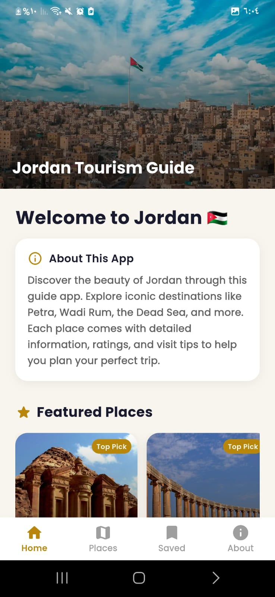
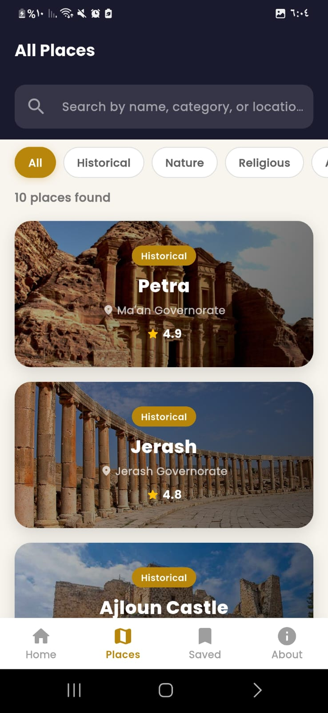
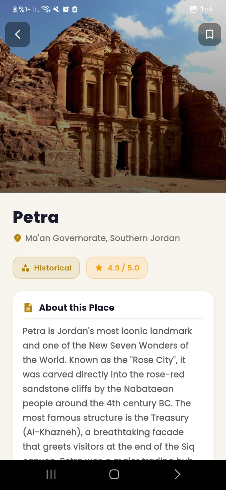
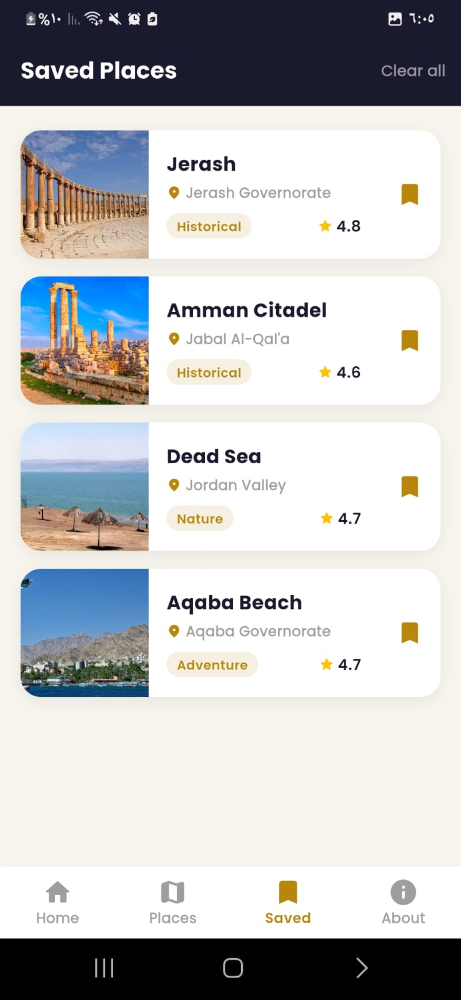
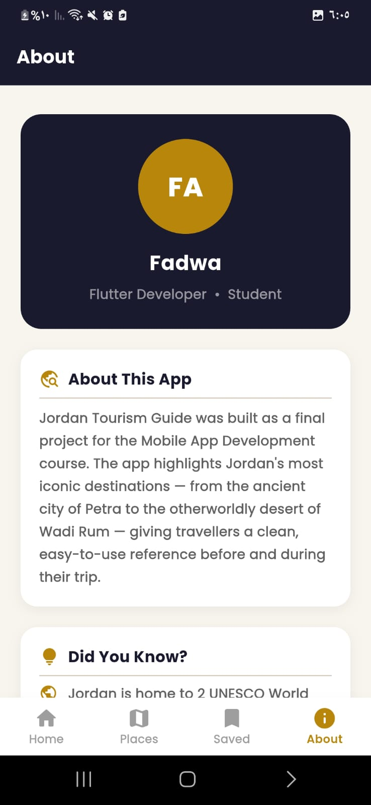

# 🇯🇴 Jordan Tourism Guide

A Flutter mobile application that helps users explore Jordan's most iconic tourist destinations — from ancient historical sites to breathtaking natural landscapes.

\---

## 👩‍💻 Developer

|Field|Details|
|-|-|
|**Name**|Fadwa Feras Abuherra|
|**Student ID**|202120315|
|**Course**|Mobile App Development|
|**Project Type**|Final Project|

\---

## 📸 Screenshots

|Home|Places|Details|
|:-:|:-:|:-:|
||||
|Saved|About|
|:-:|:-:|
|||

\---

## 📱 App Screens

The app contains **5 screens** connected via a Bottom Navigation Bar:

|Screen|Description|
|-|-|
|**Home**|Welcome screen with featured places carousel and app introduction|
|**Places**|Full list of all places with search and category filter|
|**Details**|Detailed view of each place with description, rating, and visit info|
|**Saved**|Personal bookmarks — save and revisit your favourite places|
|**About**|Developer profile, app info, and Jordan fun facts|

\---

## ✨ Features

* Browse **10 tourist destinations** across 4 categories: Historical, Nature, Religious, Adventure
* **Search** places by name or keyword
* **Filter** by category using animated chip buttons
* **Save / Unsave** places with a bookmark button on the details screen
* **Saved Places screen** — unique feature: view all bookmarked places with thumbnails, remove individually or clear all
* Network image on the Home screen header + local asset images for all places
* Smooth navigation with data passed between screens

\---

## 🗂️ Project Structure

```
lib/
├── controllers/
│   └── place\_controller.dart     # Data management \& search logic
├── models/
│   ├── place\_model.dart          # PlaceModel extends TouristItem (OOP)
│   └── category\_model.dart       # CategoryModel
├── screens/
│   ├── main\_screen.dart          # Bottom navigation controller
│   ├── home\_screen.dart          # Home / featured places
│   ├── places\_screen.dart        # List + search + filter
│   ├── details\_screen.dart       # Place details + bookmark
│   ├── favorites\_screen.dart     # Saved places (unique feature)
│   └── about\_screen.dart         # Developer info
└── widgets/
    └── place\_card.dart           # Reusable place card widget
```

\---

## 🧱 OOP Concepts Used

### 1\. Abstraction

An abstract class `TouristItem` defines the shared structure that all tourist items must follow:

```dart
abstract class TouristItem {
  String get name;
  String get description;
  double get rating;

  String getSummary() => '$name ⭐ $rating';
}
```

### 2\. Inheritance

`PlaceModel` extends `TouristItem`, inheriting its structure and implementing all required fields:

```dart
class PlaceModel extends TouristItem {
  @override
  final String name;
  @override
  final String description;
  @override
  final double rating;
  // ...
}
```

\---

## 📦 Packages Used

|Package|Purpose|
|-|-|
|`google\_fonts`|Custom Poppins typography throughout the app|

\---

## 🗄️ Data \& Models

* **PlaceModel** — holds name, category, location, description, imageUrl, isAsset, rating, visitInfo
* **CategoryModel** — holds title and description for each filter category
* **PlaceController** — manages the list of places and categories, provides `searchPlaces()` and `getFeaturedPlaces()` methods
* **FavoritesStore** — singleton class managing the saved places state

\---

## 🖼️ Assets \& Images

* Local asset images stored in `assets/images/` (registered in `pubspec.yaml`)
* One network image used on the Home screen header banner
* `pubspec.yaml` configured with assets path and `google\_fonts` dependency

\---

## 🗺️ Place Categories \& Data

|Category|Places|
|-|-|
|Historical|Petra, Jerash, Ajloun Castle, Amman Citadel|
|Nature|Wadi Rum, Dead Sea|
|Religious|Mount Nebo, Baptism Site|
|Adventure|Aqaba Beach, Dana Biosphere Reserve|

\---

## 🔧 How to Run

```bash
# Clone the repository
git clone https://github.com/YOUR\_USERNAME/jordan\_tourism\_guide.git

# Navigate to project folder
cd jordan\_tourism\_guide

# Install dependencies
flutter pub get

# Run the app
flutter run
```

\---

## 📝 Notes

* All place data is unique and written specifically for this project
* The Saved Places screen is a unique feature not taken from any classmate
* The app follows a simple MVC structure: models, screens (views), controllers, and widgets

